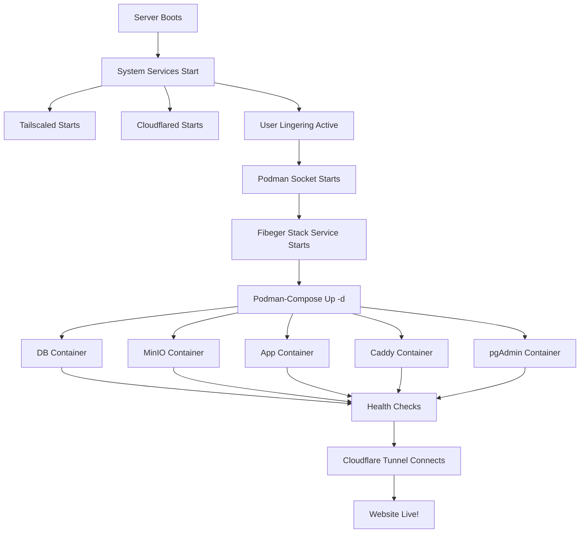

# Ensuring Reboot Resilience - Complete Guide

This document provides a complete overview of how to ensure your Fibeger deployment automatically recovers after server reboots.

## Table of Contents

1. [Quick Start](#quick-start)
2. [Why This Matters](#why-this-matters)
3. [What Needs to Start](#what-needs-to-start)
4. [One-Time Setup](#one-time-setup)
5. [Testing Your Setup](#testing-your-setup)
6. [Ongoing Monitoring](#ongoing-monitoring)
7. [Troubleshooting](#troubleshooting)

---

## Quick Start

### TL;DR - Run These Commands

```bash
# SSH into your server
ssh user@your-fedora-server

# Navigate to deployment directory
cd /opt/fibeger

# 1. Configure auto-start (one-time setup)
bash scripts/ensure-services-on-boot.sh

# 2. Test with a reboot
sudo reboot

# Wait 2-3 minutes, then SSH back in

# 3. Verify everything started
bash scripts/verify-after-reboot.sh

# 4. (Optional) Set up automated monitoring
bash scripts/setup-monitoring.sh
```

That's it! Your deployment is now reboot-resilient.

---

## Why This Matters

### The Problem

By default, when your Fedora server reboots:
- ❌ Podman containers DON'T automatically start (unless configured)
- ❌ User services stop when you log out
- ❌ Your website goes down
- ❌ GitHub Actions deployments may fail

### The Solution

With proper configuration:
- ✅ All services start automatically on boot
- ✅ Containers run even when you're logged out
- ✅ Website is available within 2-3 minutes of reboot
- ✅ GitHub Actions can deploy anytime
- ✅ Automated health checks catch issues early

---

## What Needs to Start

After a reboot, these components must start in order:

```
1. System Services (automatic by default)
   ├─ tailscaled     → For GitHub Actions SSH access
   └─ cloudflared    → For public HTTPS access

2. User Services (require configuration)
   ├─ podman.socket  → Enables container management
   └─ fibeger-stack  → Starts all containers

3. Containers (managed by fibeger-stack service)
   ├─ db (PostgreSQL)
   ├─ minio (Object Storage)
   ├─ pgadmin (Database Admin)
   ├─ app (Next.js Application)
   └─ caddy (Reverse Proxy)
```

### Critical Enabler: User Lingering

**Most Important:** Enable user lingering to keep services running when logged out.

```bash
sudo loginctl enable-linger $USER
```

Without this, containers stop when you log out or server reboots!

---

## One-Time Setup

### Step 1: Run the Auto-Start Configuration Script

```bash
cd /opt/fibeger
bash scripts/ensure-services-on-boot.sh
```

This script:
- ✅ Enables Tailscale service
- ✅ Enables Cloudflared service
- ✅ Enables user lingering
- ✅ Creates systemd service for containers
- ✅ Enables Podman socket

**Output:** You'll see a summary of what was configured.

### Step 2: Verify Configuration

```bash
# Check user lingering
loginctl show-user $USER | grep Linger
# Should show: Linger=yes

# Check services
systemctl is-enabled tailscaled    # enabled
systemctl is-enabled cloudflared   # enabled
systemctl --user is-enabled fibeger-stack.service  # enabled
```

---

## Testing Your Setup

### Test #1: Stop and Restart Services

```bash
# Stop containers
cd /opt/fibeger
podman-compose down

# Start via systemd
systemctl --user start fibeger-stack.service

# Wait 30 seconds
sleep 30

# Verify
podman-compose ps
```

All containers should be running.

### Test #2: Full Reboot Test

```bash
# Verify current state
bash /opt/fibeger/scripts/verify-after-reboot.sh

# Reboot server
sudo reboot

# Wait 2-3 minutes after reboot

# SSH back in
ssh user@your-server

# Run verification script
bash /opt/fibeger/scripts/verify-after-reboot.sh

# Check website
curl -I https://your-domain.com
```

**Expected result:** All checks pass, website is accessible.

### Test #3: Deployment Test

After reboot, verify GitHub Actions can still deploy:

```bash
# On your local machine
git commit --allow-empty -m "Test post-reboot deployment"
git push origin main

# Watch GitHub Actions
# Go to: https://github.com/YOUR_USERNAME/Fibeger/actions
```

**Expected result:** Deployment succeeds.

---

## Ongoing Monitoring

### Option 1: Manual Checks

After any server maintenance or reboot:

```bash
bash /opt/fibeger/scripts/verify-after-reboot.sh
```

### Option 2: Automated Monitoring (Recommended)

Set up periodic health checks with automatic recovery:

```bash
cd /opt/fibeger
bash scripts/setup-monitoring.sh
```

Choose your monitoring frequency:
- **Production:** Every 5 minutes
- **Low-traffic:** Every 15 minutes  
- **Development:** Every hour

**What it does:**
- Runs health checks automatically
- Restarts failed services
- Logs all checks and failures
- Optional email alerts

**View monitoring status:**

```bash
# If using systemd timer
systemctl --user status fibeger-monitor.timer

# If using cron
crontab -l

# View health check logs
ls -lh /var/log/fibeger/
cat /var/log/fibeger/failures.log
cat /var/log/fibeger/recoveries.log
```

---

## Troubleshooting

### Issue: Containers Don't Start After Reboot

**Diagnosis:**
```bash
systemctl --user status fibeger-stack.service
journalctl --user -u fibeger-stack.service -n 50
```

**Possible causes:**

1. **User lingering not enabled**
   ```bash
   # Check
   loginctl show-user $USER | grep Linger
   
   # Fix
   sudo loginctl enable-linger $USER
   ```

2. **Service not enabled**
   ```bash
   # Check
   systemctl --user is-enabled fibeger-stack.service
   
   # Fix
   systemctl --user enable fibeger-stack.service
   ```

3. **Service failed to start**
   ```bash
   # Check logs
   journalctl --user -u fibeger-stack.service -n 50
   
   # Try manual start
   cd /opt/fibeger
   podman-compose up -d
   
   # Check for errors
   podman-compose logs -f
   ```

### Issue: Tailscale Not Connected

**Diagnosis:**
```bash
sudo systemctl status tailscaled
tailscale status
```

**Fix:**
```bash
# Restart service
sudo systemctl restart tailscaled

# Reconnect
sudo tailscale up

# Verify
tailscale status
```

### Issue: Cloudflared Not Connected

**Diagnosis:**
```bash
sudo systemctl status cloudflared
sudo journalctl -u cloudflared -n 50
```

**Fix:**
```bash
# Restart service
sudo systemctl restart cloudflared

# Check config
cat /etc/cloudflared/config.yml

# Verify tunnel
sudo journalctl -u cloudflared -f
# Look for "Registered tunnel connection"
```

### Issue: Containers Running But Website Not Accessible

**Diagnosis:**
```bash
# Test local Caddy
curl -H "Host: your-domain.com" http://127.0.0.1:8080

# Check Cloudflare tunnel
sudo systemctl status cloudflared
```

**If localhost works but public domain doesn't:**
- Cloudflare tunnel needs 1-2 minutes to establish
- Check DNS: `nslookup your-domain.com`
- Restart tunnel: `sudo systemctl restart cloudflared`

**If localhost doesn't work:**
- Check Caddy logs: `podman-compose logs caddy`
- Check app logs: `podman-compose logs app`
- Verify Caddyfile: `cat /opt/fibeger/Caddyfile`

### Issue: Health Check Script Shows Errors

Run the verification script for detailed diagnostics:

```bash
bash /opt/fibeger/scripts/verify-after-reboot.sh
```

Each failed check includes:
- ❌ What failed
- 💡 How to fix it
- 📋 Commands to run

Follow the suggested fixes for each error.

---

## Checklist: Reboot Resilience

Use this checklist to verify your setup:

### Initial Configuration
- [ ] Ran `ensure-services-on-boot.sh`
- [ ] User lingering enabled: `loginctl show-user $USER | grep Linger=yes`
- [ ] Tailscaled enabled: `systemctl is-enabled tailscaled`
- [ ] Cloudflared enabled: `systemctl is-enabled cloudflared`
- [ ] Fibeger stack enabled: `systemctl --user is-enabled fibeger-stack.service`

### Testing
- [ ] Manual service restart test passed
- [ ] Full reboot test passed
- [ ] Verification script passes: `verify-after-reboot.sh`
- [ ] Website accessible after reboot
- [ ] Deployment still works after reboot

### Monitoring (Optional)
- [ ] Automated monitoring configured
- [ ] Health checks running periodically
- [ ] Log directory created: `/var/log/fibeger/`
- [ ] Email alerts configured (if desired)

### Documentation
- [ ] Read `AUTO_START_AFTER_REBOOT.md`
- [ ] Bookmarked `REBOOT_QUICK_REFERENCE.md`
- [ ] Know how to view logs
- [ ] Know how to restart services manually

---

## Architecture Overview

### Boot Sequence



### Service Dependencies

```
System Level:
  tailscaled (enabled) → Always available for SSH
  cloudflared (enabled) → Always available for HTTPS tunnel

User Level (requires lingering):
  podman.socket (enabled) → Manages containers
  fibeger-stack.service (enabled) → Orchestrates all containers
    ├─ Depends on: network-online.target
    └─ Executes: podman-compose up -d

Container Level (restart: unless-stopped):
  All containers automatically restart if they crash
  They start via fibeger-stack.service on boot
```

---

## Best Practices

### 1. Regular Testing

Test reboots regularly (monthly recommended):

```bash
# Before scheduled maintenance
bash /opt/fibeger/scripts/verify-after-reboot.sh

# Schedule maintenance window
sudo reboot

# After reboot
bash /opt/fibeger/scripts/verify-after-reboot.sh
```

### 2. Monitor Logs

Check logs periodically:

```bash
# System services
sudo journalctl -u tailscaled -n 50
sudo journalctl -u cloudflared -n 50

# User services
journalctl --user -u fibeger-stack.service -n 50

# Containers
cd /opt/fibeger && podman-compose logs --tail=100
```

### 3. Keep System Updated

```bash
# Update system packages
sudo dnf update -y

# Update containers
cd /opt/fibeger
podman-compose pull
podman-compose up -d
```

### 4. Document Customizations

If you modify the setup, document your changes:

```bash
# Create a notes file
cat >> /opt/fibeger/CUSTOMIZATIONS.md << EOF
## $(date)
- Changed monitoring frequency to 10 minutes
- Added custom environment variable X
EOF
```

### 5. Backup Configuration

Backup critical files:

```bash
# Backup to home directory
mkdir -p ~/fibeger-backup
cp /opt/fibeger/.env ~/fibeger-backup/
cp /opt/fibeger/docker-compose.yml ~/fibeger-backup/
cp /etc/cloudflared/config.yml ~/fibeger-backup/
```

---

## Related Documentation

- **[AUTO_START_AFTER_REBOOT.md](AUTO_START_AFTER_REBOOT.md)** - Detailed guide
- **[REBOOT_QUICK_REFERENCE.md](REBOOT_QUICK_REFERENCE.md)** - Quick command reference
- **[DEPLOYMENT_GUIDE.md](DEPLOYMENT_GUIDE.md)** - Full deployment guide
- **[DEPLOYMENT_CHECKLIST.md](DEPLOYMENT_CHECKLIST.md)** - Deployment checklist
- **[scripts/README.md](../scripts/README.md)** - Scripts documentation

---

## Scripts Reference

| Script | Purpose | When to Run |
|--------|---------|-------------|
| `ensure-services-on-boot.sh` | Configure auto-start | Once after deployment |
| `verify-after-reboot.sh` | Health check all services | After every reboot |
| `setup-monitoring.sh` | Set up automated monitoring | Once (optional) |

---

## Summary

### What You've Achieved

After completing this setup, your Fibeger deployment:

✅ **Survives reboots** - All services start automatically  
✅ **Runs 24/7** - User lingering keeps containers alive  
✅ **Self-heals** - Automated monitoring restarts failed services  
✅ **Stays accessible** - Website available within 3 minutes of boot  
✅ **CI/CD ready** - GitHub Actions can deploy anytime  
✅ **Production-ready** - Enterprise-grade reliability  

### Expected Uptime

With this setup:
- **Server reboot:** 2-3 minutes downtime
- **Deployment:** Zero downtime (rolling restart)
- **Service failure:** 5-15 minutes (if monitoring enabled)

### Next Steps

1. ✅ Complete the one-time setup
2. ✅ Test with a reboot
3. ✅ Configure monitoring
4. ✅ Schedule regular tests
5. ✅ Document any customizations

---

## Support

If you encounter issues:

1. **Run diagnostics:**
   ```bash
   bash /opt/fibeger/scripts/verify-after-reboot.sh | tee /tmp/diagnostics.txt
   ```

2. **Check logs:**
   ```bash
   sudo journalctl -b -n 100 > /tmp/boot-logs.txt
   sudo journalctl -u cloudflared -n 50 > /tmp/cloudflared.txt
   journalctl --user -u fibeger-stack.service -n 50 > /tmp/fibeger-service.txt
   cd /opt/fibeger && podman-compose logs --tail=50 > /tmp/containers.txt
   ```

3. **Review documentation:**
   - Check troubleshooting sections in this guide
   - See `REBOOT_QUICK_REFERENCE.md` for common fixes
   - Review `AUTO_START_AFTER_REBOOT.md` for detailed explanations

4. **Test manually:**
   ```bash
   cd /opt/fibeger
   podman-compose down
   podman-compose up -d
   podman-compose logs -f
   ```

---

**Document Version:** 1.0  
**Last Updated:** 2026-01-23  
**Tested On:** Fedora 38+, Podman 4.0+
